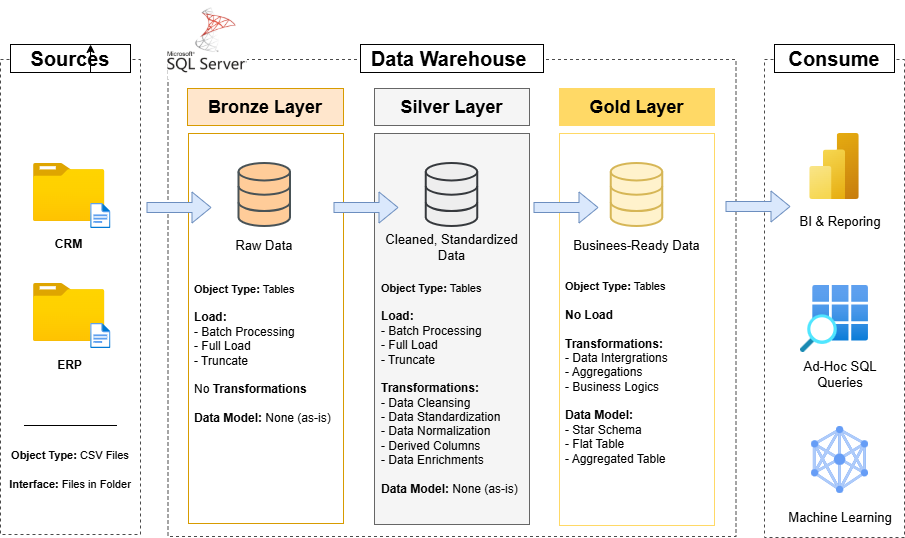

# Data Warehouse and Analytics Project 🚀

Welcome to the **Data Warehouse and Analytics Project** repository!

This project showcases a complete end-to-end pipeline from data warehousing to generating actionable insights using industry-standard data engineering and analytics practices.

---

## 🛠️ Data Architecture

The data architecture for this project follows the **Medallion Architecture** (Bronze, Silver, and Gold layers) to ensure data quality and reliability as it moves through the pipeline:

### 🥉 Bronze Layer (Raw Data)
* **Sources**: Ingests raw data from various sources such as CRM (CSV files) and ERP systems.
* **Process**: Data is loaded using Batch Processing (Full Load or Truncate & Insert) via Stored Procedures.
* **Data Model**: Data is kept in its original format (as-is) with no transformations applied.

### 🥈 Silver Layer (Cleaned & Standardized)
* **Process**: Data is moved from Bronze to Silver using Stored Procedures for refinement.
* **Transformations**: Includes Data Cleansing, Standardization, Normalization, and Enrichment.
* **Goal**: To provide a "Single Source of Truth" with high-quality, standardized tables.

### 🥇 Gold Layer (Business-Ready Data)
* **Process**: Final transformation layer where data is modeled for end-user consumption.
* **Transformations**: Focuses on Business Logic, Aggregations, and Data Integration.
* **Data Model**: Implements **Star Schema**, Flat Tables, or Aggregated Tables using Database Views.
* **Consume**: Ready for BI Reporting (Power BI), Ad-Hoc SQL Queries, and Machine Learning.

---

## 📖 Project Overview

**Key project milestones include:**

* **Data Architecture**: Implementing a **Medallion Architecture** using **Bronze, Silver, and Gold** layers to ensure a clean and reliable data flow.
* **ETL Pipelines**: Designing workflows to **Extract, Transform, and Load** data from source systems (CRM/ERP) into the centralized warehouse.
* **Data Modeling**: Developing optimized **Fact and Dimension tables** (Star Schema) to support high-performance analytical queries.
* **Analytics & Reporting**: Translating complex data into **actionable insights** through SQL-based reporting and interactive dashboards.

---
## 🚀 Project Requirements

### Building the Data Warehouse (Data Engineering)

#### Objective
Develop a modern data warehouse using SQL Server to consolidate sales data, enabling analytical reporting and informed decision-making.

#### Specifications
- **Data Sources**: Import data from two source systems (ERP and CRM) provided as CSV files.
- **Data Quality**: Cleanse and resolve data quality issues prior to analysis.
- **Integration**: Combine both sources into a single, user-friendly data model designed for analytical queries.
- **Scope**: Focus on the latest dataset only; historization of data is not required.
- **Documentation**: Provide clear documentation of the data model to support both business stakeholders and analytics teams.

---
### BI: Analytics & Reporting (Data Analysis)

#### Objective
Develop SQL-based analytics to deliver detailed insights into:
- **Customer Behavior**
- **Product Performance**
- **Sales Trends**

These insights empower stakeholders with key business metrics, enabling strategic decision-making.  

---
### License

This project is licensed under the [MIT License]. You are free to use, modify, and share this project with proper attribution.

